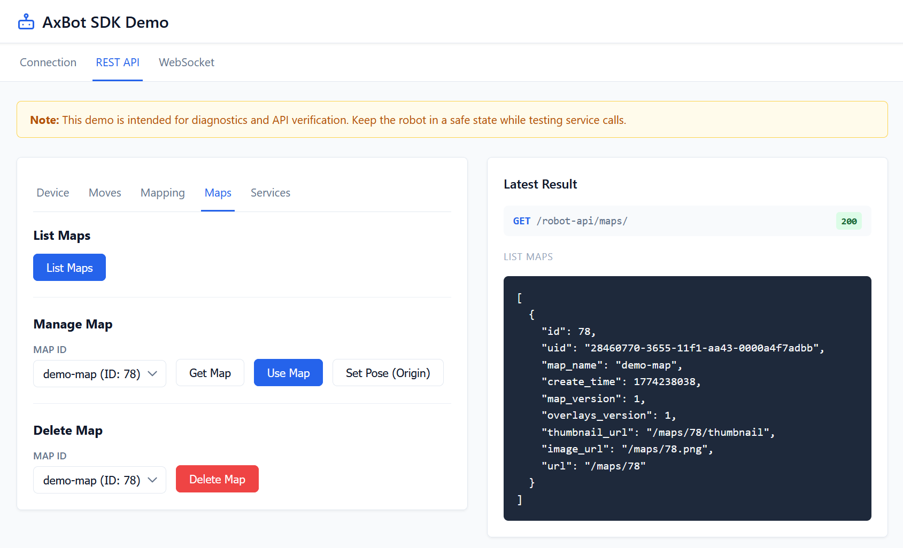
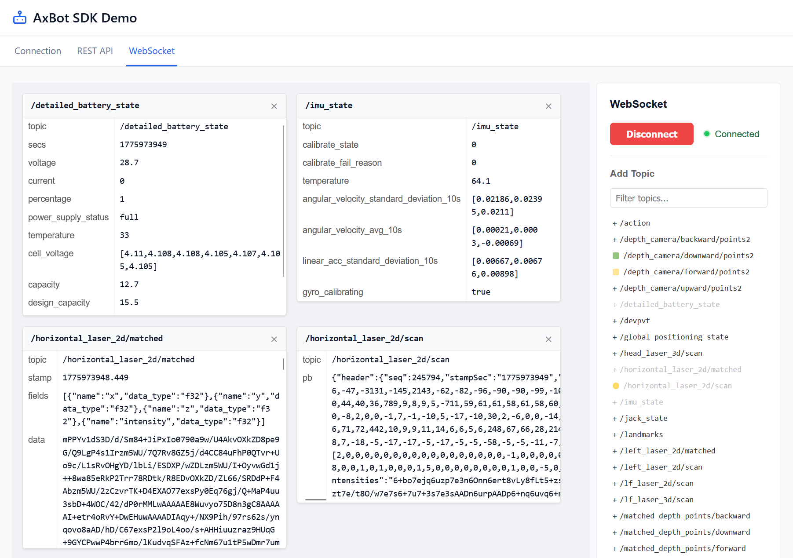

# axbot-ts-sdk-demo

An interactive browser-based demo for the [axbot-ts-sdk](https://github.com/AutoxingTech/axbot-ts-sdk) — a TypeScript SDK for controlling Autoxing AMRs via REST and WebSocket APIs.




## Features

- **Connection tab** — configure the robot's base URL, WebSocket URL, and authentication cookie; the app proxies requests through a local Vite dev server to avoid CORS issues.
- **REST tab** — exercise common REST calls: wake device, set control mode, emergency stop, jack up/down, maps, mappings, moves, services, and more.
- **WebSocket tab** — subscribe to live robot topics and inspect the decoded messages in real time.

## Prerequisites

- [Node.js](https://nodejs.org/) 18+
- [pnpm](https://pnpm.io/) 10+

## Getting started

```bash
git clone https://github.com/AutoxingTech/axbot-ts-sdk-demo
cd axbot-ts-sdk-demo
pnpm install
pnpm dev
```

Open <http://localhost:6173> in your browser.

## Usage

1. Enter the robot's **Base URL** (e.g. `http://192.168.x.x`) in the Connection tab and click **Connect**.
2. Switch to the **REST** tab to call API methods and view JSON responses.
3. Switch to the **WS** tab to subscribe to WebSocket topics and watch live data.

## SDK

This demo depends on [`@kingsimba/axbot-sdk`](https://www.npmjs.com/package/@kingsimba/axbot-sdk).  
Source and full documentation: <https://github.com/AutoxingTech/axbot-ts-sdk>

## License

[MIT](LICENSE) — Copyright (c) 2026 Autoxing Technology
